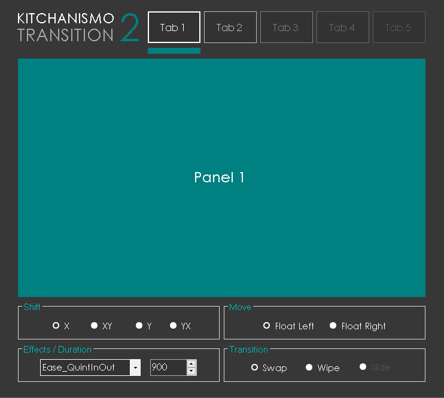

# KITCHANISMO TRANSITION

A library for animated UI transitions for .NET (C#,VB)

# Download
[Download kitchanismo_transition.dll](http://www.mediafire.com/file/58xb9puth7ep7c9/kitchanismo_transition.dll)

# Getting Started
Add as reference kitchanismo_transition.dll

VB Imports kitchanismo_transition

C# using kitchanismo_transition;

Instatiante the Kitchanismo class

VB Dim kitchanismo as New Kitchanismo

C# using kitchanismo_transition; Kitchanismo kitchanismo = new Kitchanismo();

# Sample Code in C#

using System.Drawing.Imaging; 
using System.Drawing.Drawing2D; 
using System.Collections; 
using System.Reflection; 
using System.Runtime.InteropServices; 
using kitchanismo_transition;

namespace test  { 

public partial class SampleUse : Form { 

Kitchanismo kitchan = new Kitchanismo();

    Color silver = Color.Silver;
    Color gray = Color.Gray;
    Color dgray = Color.DimGray;
    Color egray = Color.FromArgb(90, 90, 90);
    Point p;
    int speed = 900;
    
    public SampleUse()
    {
        
        InitializeComponent();
        TProperties.initLocation(getGUID());
        TProperties.speed = speed;
       
    }

    private void btntab1_Click(object sender, EventArgs e)
    {
        move_accent(btntab1, panel1.BackColor);
        customize_transition(panel1);
        kitchan.changeforecolor_control(btntab2, silver);
        kitchan.changeforecolor_control(btntab3, gray);
    }

    private void btntab2_Click(object sender, EventArgs e)
    {
        move_accent(btntab2, panel2.BackColor);
        customize_transition(panel2);
        kitchan.changeforecolor_control(btntab1, silver);
        kitchan.changeforecolor_control(btntab3, silver);
 
    }

    private void btntab3_Click(object sender, EventArgs e)
    {
        move_accent(btntab3, panel3.BackColor);
        customize_transition(panel3);
        kitchan.changeforecolor_control(btntab1, gray);
        kitchan.changeforecolor_control(btntab2, silver);
    }

    void move_accent(Button btn, Color col)
    {
        p.Y = pnnav.Location.Y;
        p.X = btn.Location.X;
        kitchan.move_animation(pnnav, p, 30);
        kitchan.changebackcolor_control(pnnav, col);
        kitchan.changeforecolor_control(btn, Color.White);
        kitchan.changeforecolor_control(lblversion, col);
    }

    void initType(Control target)
    {
       
        //target move
        TProperties.nav = target;

        //max of 5 panels, min of 2
        TProperties.nav1 = panel1;
        TProperties.nav2 = panel2;
        TProperties.nav3 = panel3;
        TProperties.nav4 = new Panel();
        TProperties.nav5 = new Panel();

        //assign location, speed, ease to TProperty
        TProperties.loc = 0;
        TProperties.speed = speed;
        TProperties.ease = IEasing.bounceout;
    }

    public void customize_transition(Control target)
    {
       //call methos
       initType(target);

       //see CustomizeTransition form to see more custom transitions
       //kitchan.x_swap(true);//swap , x , left
       //kitchan.x_swap(false);//swap , x , right

       kitchan.y_swap(true);//swap , y , down
       //kitchan.y_swap(false);//swap , y , up   
    }

}
