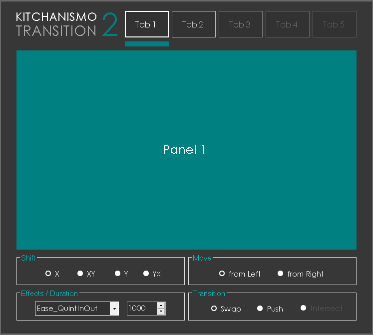

# KITCHANISMO TRANSITION

A library for animated UI transitions for .NET (C#,VB)

# Download

# Getting Started

using System;
using System.Collections.Generic;
using System.ComponentModel;
using System.Data;
using System.Drawing;
using System.Linq;
using System.Text;
using System.Windows.Forms;

//import namespace
using Kitchanismo;

namespace BasicSampleTransition
{
    public partial class BasicUsage : Form
    {
        //instantiate transition
        KitchanismoTransition transition = new KitchanismoTransition();

        public BasicUsage()
        {
            InitializeComponent();
            InitializePanel();
            InitializeTransition();
        }

        //create panels an buttons to UI
        //put all panels inside PanelWrapper

        //PanelWrapper
        //PanelGreen
        //PanelGold
        //PanelIndigo

        //BtnGreen
        //BtnlGold
        //BtnelIndigo

        //re-aligning all panels inside panel wrapper to its origin location
        private void InitializePanel()
        {
            var origin           = new Point(0,0);

            PanelGold.Location   = origin;
            PanelIndigo.Location = origin;
            PanelGreen.Location  = origin;
        }

        //transition requirements
        private void InitializeTransition()
        {
            //Control Arrays (2 or More)
            //First array should be Active
            transition.TabArray(PanelGold, PanelGreen, PanelIndigo);

            //Duration (1000 == 1 sec)
            transition.Speed         = 1000;
         
            //Effects (change for your own desire)
            transition.Ease          = Easing.CubicInOut;
            transition.Type          = TypeTransition.Swap;
            transition.Shift         = ShiftTransition.Y;
            transition.ReverseShift  = true;
        }

        //assigning PanelGreen as Active Tab
        private void BtnGreen_Click(object sender, EventArgs e)
        {
            transition.Run(PanelGreen);
        }

        //assigning PanelIndigo as Active Tab
        private void BtnIndigo_Click(object sender, EventArgs e)
        {
            transition.Run(PanelIndigo);
        }

        //assigning PanelGold as Active Tab
        private void BtnGold_Click(object sender, EventArgs e)
        {
            transition.Run(PanelGold);
        }

    }
}
